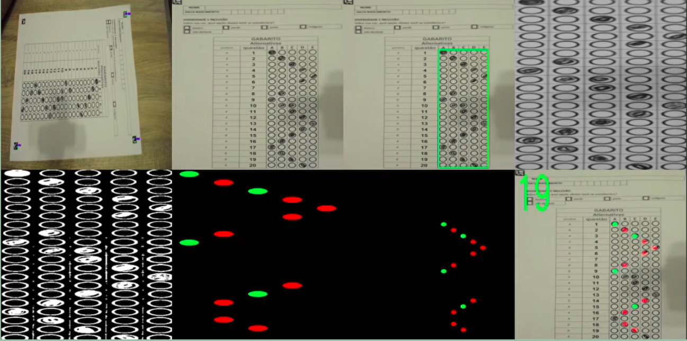
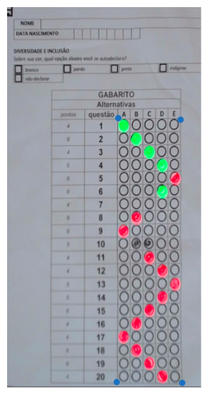

# Aoba, vamos lá

### Disclaimers:

- Este é um readme feito as rápidamente, qualquer dúvida mande msg
- Ao contrário do que pode ter parecido, a gigantesca maior parte desse projeto foi feito durante o trabalho e n em casa, ou seja sem muito tempo: muita coisa mal feita
- Algumas configurações são muito específicas para a câmera/aruco utilizados, vale estudar e fazer algo mais configurável
- Apesar de essa ser a versão mais recente (fora o executável) que tenho, não garanto que ela esteja funcionando

##### Desvendando esse projeto:

###### Geral

Em teoria o projeto está fazendo algumas coisas. Todas em um só lugar inclusive, algo que deveria ser separado. São elas:

1 - Cria um "front" como um aplicativo desktop usando o flask. Tipo um windowsforms mas em python e com html
2 - Cria endpoints para esse "front" que permite interações com o alguns métodos gerados
3 - Faz o stream do processamento do gabarito para esse "front"
4 - Permite edição de um excel

| Arquivo     | ideia                                                                                       |
| ----------- | ------------------------------------------------------------------------------------------- |
| utils       | conjunto de funções muito utilizadas para processos gerais                                  |
| main.py     | toda lógica, sim deveria ser melhor organizado                                              |
| index       | configuração visual do aplicativo flask                                                     |
| video.jpg   | arquivo utilizado para o "streaming", é sobrescrito para gerar "vídeo"                      |
| scanner.exe | executável do projeto                                                                       |
| database    | n lembro, mas acho que tem uns metodos pra add/edit dados                                   |
| main.js     | nem ideia, e se importante tem q limpar. n tinha gpt e tava copiando e testando muita coisa |

###### Outras coisas importantes

Você com toda certeza pode fazer um trabalho muito melhor e com tempo em relação a parte do "front" até na época eu achava essa solução ruim, mas foi rápido. Porém vou deixar algumas dicas para o main pq lá tem algumas coisas que podem ser chatas. Além de explicar a lógica de visão computacional

###### Extração do gabarito

Explicando em alguns passos, seguindo a imagem de referência ^

(não necessáriamente está em ordem nem precisa ser assim, só estou registrando oq lembro)

1 - Os 4 arucos são procurados. Não necessáriamente todos estão legíveis em um mesmo momento, mas conforme encontramos atualizamos uma informação que mapeia onde cada canto está na imagem.

2 - Realizamos um warp, um método que pega esses cantos e transforma em uma imagem "reta". O opencv já oferece um suporte pra isso através do getPerspectiveTransform e warpPerspective

3 - Selecionamos um retângulo de interesse, que é a área que contém as respostas. Já que a imagem já fez o warp e está estabilizada, se trata de uma posição fixa

4 - Aplicamos algoritmos de nossa escolha pra permitir uma melhor separação do que é preenchido ou não. Nesse caso acredito que foi feito um blur e alguma variação do otsu. Recomendo olhar o canal do acerola, ele tem umas ideias boas de como fazer algo melhor. Hoje em dia eu provavelmente faria algo diferente

5 - Dividimos o retángulo pelo número de linhas/questões, sobrando pequenas imagens de cada círculo em preto e branco

6 - Através de uma heurística/threshold definimos se cada bloquinho está preenchido ou não

7 - Geramos um círculo vermelho/verde de acordo com cada questão que encontramos. Caso não hajam múltiplas questões marcadas e não esteja em branco

8 - Colocamos os círculos por cima da imagem reta (em relação a posição de onde eles foram extraidos) para ficarem no local certo

9 - Retornamos a contagem de questões corretas

###### Main

Primeiro, aruco é tipo um qr code mas pra visão computacional. Você vai ver nesse código muita configuração de câmera, isso é importante de se atentar a isso pq diferentes câmeras tem diferentes distorções e isso pode facilmente quebrar a eficiência de certos algorítmos

As configurações do teste são relativamente tranquilas, porém isso aqui
answersCorners = [(590, 583), (925, 1903)]
pode ser um pouco confuso, basicamente são duas coordenadas, xy e xy
Se refêrem a esses cantos em azul (superior esquerdo e inferior direito)

arUcoPoints = [326, 683, 779, 856]
Cada número se refere a um aruco, assim como um qr code costuma ter uma url, um aruco tem um valor e eles estão nessa ordem no padrão de teste que gerei
